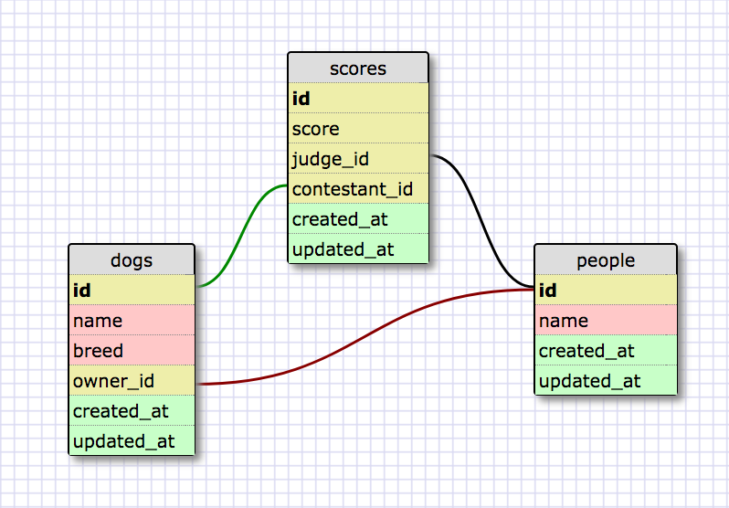

# AR Associations Drill: Not Shirts

## Notes:
This is modeled directly off of the shirts challenge from DBC. Most of the readme has been unaltered. I have only changed the assignment specific details and added my process for creating associations here:

1.  what's the method you want to be able to call on the instance? (`@shirt.purchaser` means you want to be able to call `purchaser`)

2. Is the method you want to call plural or not? (Has many vs belongs to)

3. construct the basic association (has many or belongs to, followed by the name of the method as a symbol, ex: `belongs_to :purchaser`)

4. Is it a single step association or do you have to go through things?

If it is only one step:

5. does the class you're looing to connect to have the same name as the association (not worrying about plural vs. singular)?

If not, specifiy the approprate class name with `class_name`. e.g.: `class_name: 'User'`

6. Does the foreign key on the appropriate table match?
  A. If it's a `belongs_to` then the class you're writing the association in will have the foreign key on it. Activerecord will expect the foreign key to then match whatever you're calling the association (`belongs_to :designer` will expect a `designer_id` foreign key). If this doesn't match then you have to specify which class it connects to with the `foreign_key` option.
  B. If it's a `has_many` the foreign key will be on the other table, so you'll be looking for an ID pointing to the class you're currently on. If a Shirt has many sales, we'll want to make sure that the class we're pointing to has a `shirt_id` field. If not, specify it with the `foreign_key: <foreign key>` option (where the foreign key you'll specify is the one that is on the table. see User purchases).

If it's more than one step:

5. Find the association that gets you to one step away that you've already declared in your current class (if you don't have one of those you'll have to write it). Use the `through: <association name>` option to denote the association you want to go through.

6. Then go to the class that you've gotten to with the `through: <association name>` option and find the association that gets you the final step on it. If it's the same as the association you've just written, you're good, otherwise: use `source: <associaiton name>` to specify which association you're using to make the final step.

If you've followed those, your associations should work!

## Summary
This challenge is a drill to work with [Active Record associations][RailsGuides Associations].  We'll be working with [`:belongs_to`][belongs_to] and [`:has_many`][has_many] associations.  We'll practice breaking Active Record conventions and passing options like `:class_name`, `:foreign_key`, `:through`, and `:source` when declaring associations.

*Figure 1*. Schema design for this challenge.

We'll focus on writing associations in this challenge, but let's imagine that we're building a full application that a professional dog show uses to display it's contest results and statistics. This is a special dog show where the judges are made up of the owners who put their dogs in the competition!

When our associations have been written, we'll be able to answer the following questions.

*For a Score ...*

1. Which judge gave the scoring?
2. Which dog was judged?

*For a Dog ...*

1. Which person owns the dog?
2. Which scores refer to the dog?
3. Which judges have scored the dog?

*For a Person ...*

1. Which dogs does the person own?
2. Which scores were given by the person?
3. Which dogs has the person scored?
4. In which scorings was a dog owned by the person scored?
5. Which people have rated dogs owned by the person?
6. Which people owned dogs scored by the person?

### Roles and Associations
When using a model as a through model, it will be important for us to understand the roles represented by its associations.  In this challenge, our `Person` model will behave in two different roles.  It will be a dog owner and a dog scorer.  When we define associations between `Person` and our other models, we'll define them based on these roles.  For example, a dog has a *owner* and also *judges*—both of which are really people.  If we want to get to people through the `Dog` model, do we want to get to owners or judges?

## Releases

### Pre-release: Setup
The necessary models and migrations have been provided for us.  We will need to set up the database though.  Lets bundle to make sure that the necessary gems are installed and then create and migrate our database.

### Release 0: Declare the Associations
Tests for each model's associations have been written to provide feedback on the associations that we write (see the files in `spec/models/`).  When all of the tests pass, our associations are written properly.

In order to write the desired associations, we'll need to be familiar with declaring different types of associations:

- [:belongs_to][RailsGuides belongs_to]
- [:has_many][RailsGuides has_many]
- [:has_many with the :through option][RailsGuides has_many through]
- [:has_many with the :through and :source options][StackOverflow on source]

## Conclusion
In this challenge our goal was to write some advanced Active Record associations—in particular, defining has many through associations.  We should be sure that we understand how the `:source` option works in a has many through association.  When do we need to specify a source association?  How can we identify the possible values for source?

[belongs_to]: http://apidock.com/rails/ActiveRecord/Associations/ClassMethods/belongs_to
[has_many]: http://apidock.com/rails/v4.2.1/ActiveRecord/Associations/ClassMethods/has_many
[RailsGuides Associations]: http://guides.rubyonrails.org/association_basics.html
[RailsGuides belongs_to]: http://guides.rubyonrails.org/association_basics.html#the-belongs-to-association
[RailsGuides has_many]: http://guides.rubyonrails.org/association_basics.html#the-has-many-association
[RailsGuides has_many through]: http://guides.rubyonrails.org/association_basics.html#the-has-many-through-association
[StackOverflow on source]: http://stackoverflow.com/questions/4632408/need-help-to-understand-source-option-of-has-one-has-many-through-of-rails
